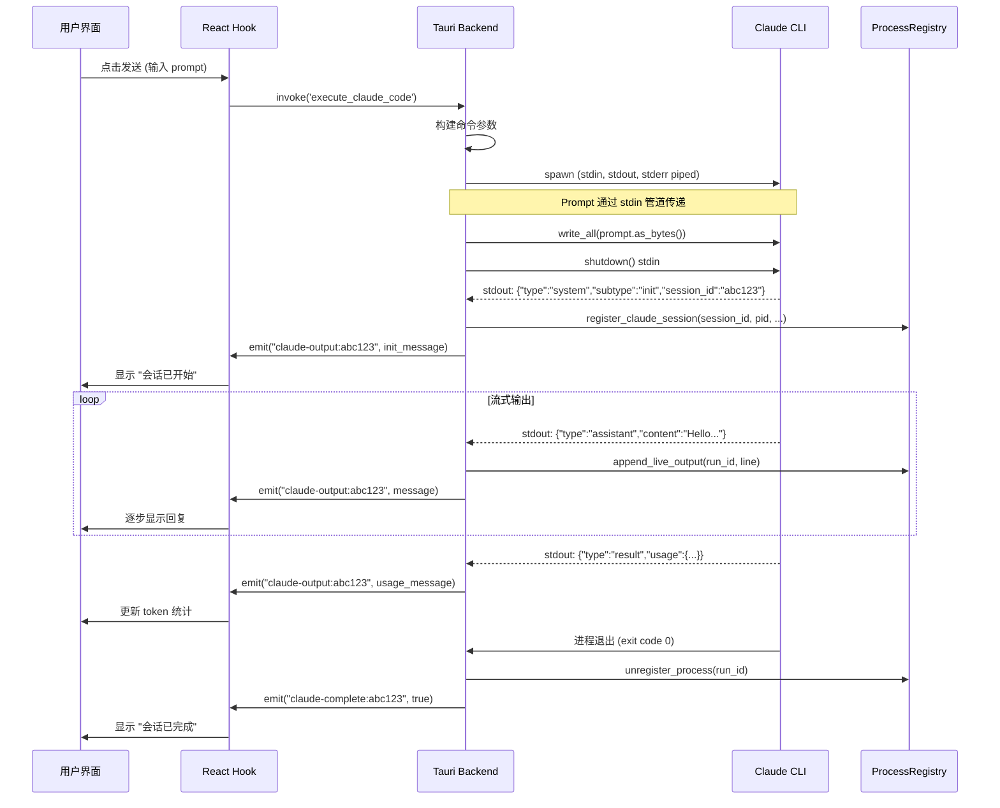

# Any Code 项目 - 通信机制深度分析

**项目**: Any Code (AI 代码助手桌面应用)
**架构**: Tauri (Rust 后端 + React 前端)
**分析日期**: 2025-12-20

---

## 📋 项目概述

Any Code 是一个专业的 AI 代码助手桌面应用，支持三大 AI 引擎:
- **Claude Code CLI** (Anthropic)
- **OpenAI Codex**
- **Google Gemini CLI**

采用 **Tauri 框架**，Rust 后端 + React TypeScript 前端架构。

---

## 🔧 技术栈

### 后端 (Rust)
- **框架**: Tauri
- **异步运行时**: Tokio
- **进程管理**: tokio::process::Command
- **序列化**: serde_json
- **日志**: log crate

### 前端 (React + TypeScript)
- **UI 框架**: React 18
- **构建工具**: Vite
- **状态管理**: Context API + Hooks
- **Tauri API**: @tauri-apps/api

---

## 🎯 通信架构总览

```
┌──────────────────────────────────────────────────────────────┐
│                    用户界面 (React)                          │
│  ClaudeCodeSession.tsx, usePromptExecution.ts 等            │
└────────────────────┬─────────────────────────────────────────┘
                     │ Tauri Command API
                     │ (invoke)
                     ↓
┌──────────────────────────────────────────────────────────────┐
│                  Tauri 后端 (Rust)                           │
│                                                               │
│  ┌─────────────────────────────────────────────────────┐    │
│  │  Tauri Commands Layer                                │    │
│  │  • execute_claude_code()                             │    │
│  │  • continue_claude_code()                            │    │
│  │  • cancel_claude_execution()                         │    │
│  └─────────────────────┬───────────────────────────────┘    │
│                        │                                      │
│                        ↓                                      │
│  ┌─────────────────────────────────────────────────────┐    │
│  │  Process Management Layer                            │    │
│  │  • spawn_claude_process()                            │    │
│  │  • ProcessRegistry (会话管理)                        │    │
│  │  • ClaudeProcessState (进程状态)                     │    │
│  └─────────────────────┬───────────────────────────────┘    │
│                        │                                      │
│                        ↓                                      │
│  ┌─────────────────────────────────────────────────────┐    │
│  │  Child Process (Claude CLI)                          │    │
│  │  stdin: prompt 输入                                   │    │
│  │  stdout: JSONL 流式输出                              │    │
│  │  stderr: 错误日志                                    │    │
│  └─────────────────────┬───────────────────────────────┘    │
│                        │                                      │
│                        │ Tauri Event Emitter                 │
│                        │ (app.emit)                           │
└────────────────────────┼──────────────────────────────────────┘
                         │
                         ↓
┌──────────────────────────────────────────────────────────────┐
│              Tauri Event Listener (前端)                     │
│  listen("claude-output:sessionId", ...)                     │
│  listen("claude-error:sessionId", ...)                      │
│  listen("claude-complete:sessionId", ...)                   │
└──────────────────────────────────────────────────────────────┘
```

---

## 📡 核心通信流程

### Phase 1: 用户发起请求

**前端 (React)**:
```typescript
// src/hooks/usePromptExecution.ts
const executeClaudeCode = async (prompt: string) => {
  // 调用 Tauri Command
  await invoke('execute_claude_code', {
    projectPath: '/path/to/project',
    prompt: prompt,
    model: 'sonnet',
    planMode: false,
    maxThinkingTokens: 10000
  });
};
```

---

### Phase 2: 后端启动 CLI 进程

**后端 (Rust)**:
```rust
// src-tauri/src/commands/claude/cli_runner.rs

#[tauri::command]
pub async fn execute_claude_code(
    app: AppHandle,
    project_path: String,
    prompt: String,
    model: String,
    plan_mode: Option<bool>,
    max_thinking_tokens: Option<u32>,
) -> Result<(), String> {
    // 1. 构建 CLI 命令参数
    let args = build_execution_args(&execution_config, &mapped_model);

    // 2. 创建 Command
    let mut cmd = Command::new(claude_path);
    cmd.args(&args);
    cmd.current_dir(&project_path);

    // 3. 配置 stdio (重要!)
    cmd.stdin(Stdio::piped());   // 用于传递 prompt
    cmd.stdout(Stdio::piped());  // 捕获 JSONL 输出
    cmd.stderr(Stdio::piped());  // 捕获错误

    // 4. 启动进程
    spawn_claude_process(app, cmd, prompt, model, project_path).await
}
```

#### 🔑 关键设计: Prompt 通过 stdin 传递

**为什么不用命令行参数?**
- ❌ 命令行长度限制:
  - Windows: ~8KB
  - Linux/macOS: ~128KB-2MB
- ✅ stdin 管道无长度限制

**实现方式**:
```rust
// 检测是否为斜杠命令 (/review, /init 等)
let use_p_flag = is_slash_command(&prompt);

if use_p_flag {
    // 斜杠命令通过 -p 参数传递 (触发 CLI 解析)
    cmd.arg("-p");
    cmd.arg(&prompt);
} else {
    // 普通 prompt 通过 stdin 管道传递
    if let Some(mut stdin) = child.stdin.take() {
        tokio::spawn(async move {
            stdin.write_all(prompt.as_bytes()).await?;
            stdin.shutdown().await?;  // 关闭 stdin 表示输入完成
        });
    }
}
```

---

### Phase 3: 流式输出处理

**核心机制: 逐行读取 stdout 并解析 JSONL**

```rust
async fn spawn_claude_process(...) -> Result<(), String> {
    // 获取子进程的 stdout
    let stdout = child.stdout.take().ok_or("Failed to get stdout")?;
    let stdout_reader = BufReader::new(stdout);

    // 异步逐行读取
    tokio::spawn(async move {
        let mut lines = stdout_reader.lines();
        while let Ok(Some(line)) = lines.next_line().await {
            // 1. 解析 JSONL
            if let Ok(msg) = serde_json::from_str::<serde_json::Value>(&line) {

                // 2. 提取 session_id (初始化消息)
                if msg["type"] == "system" && msg["subtype"] == "init" {
                    let session_id = msg["session_id"].as_str();
                    // 注册会话到 ProcessRegistry
                    registry.register_claude_session(session_id, pid, ...);
                }

                // 3. 提取 token 使用统计
                if let Some(usage) = msg.get("usage") {
                    let input_tokens = usage["input_tokens"].as_u64();
                    let output_tokens = usage["output_tokens"].as_u64();
                    // 存储到数据库用于实时统计
                }
            }

            // 4. 存储实时输出到 ProcessRegistry
            registry.append_live_output(run_id, &line);

            // 5. 发送事件到前端 (关键!)
            // 会话隔离事件
            app.emit(&format!("claude-output:{}", session_id), &line);
            // 兼容性通用事件
            app.emit("claude-output", &line);
        }
    });

    // 同时处理 stderr
    tokio::spawn(async move {
        let mut lines = stderr_reader.lines();
        while let Ok(Some(line)) = lines.next_line().await {
            app.emit(&format!("claude-error:{}", session_id), &line);
        }
    });

    // 等待进程结束
    tokio::spawn(async move {
        let status = child.wait().await?;
        app.emit(&format!("claude-complete:{}", session_id), status.success());
    });

    Ok(())
}
```

#### 🎯 事件命名策略

**会话隔离事件** (推荐):
```rust
claude-output:{session_id}    // 每条 JSONL 消息
claude-error:{session_id}      // 错误消息
claude-complete:{session_id}   // 会话结束
claude-cancelled:{session_id}  // 会话取消
claude-session-state           // 会话状态变化 (started/stopped)
```

**通用事件** (向后兼容):
```rust
claude-output      // 兼容旧代码
claude-error       // 兼容旧代码
claude-complete    // 兼容旧代码
```

---

### Phase 4: 前端接收并渲染

**前端监听事件**:

```typescript
// src/hooks/useSessionLifecycle.ts

const reconnectToSession = async (sessionId: string) => {
  // 监听会话特定的输出
  const outputUnlisten = await listen<string>(
    `claude-output:${sessionId}`,
    async (event) => {
      try {
        // 1. 存储原始 JSONL
        setRawJsonlOutput(prev => [...prev, event.payload]);

        // 2. 解析消息
        const message = JSON.parse(event.payload) as ClaudeStreamMessage;

        // 3. 应用翻译 (如果启用)
        await processMessageWithTranslation(message, event.payload);

        // 4. 更新 UI
        // (消息会被添加到状态并触发 React 重新渲染)
      } catch (err) {
        console.error("Failed to parse message:", err);
      }
    }
  );

  // 监听错误
  const errorUnlisten = await listen<string>(
    `claude-error:${sessionId}`,
    (event) => {
      setError(event.payload);
    }
  );

  // 监听完成
  const completeUnlisten = await listen<boolean>(
    `claude-complete:${sessionId}`,
    () => {
      setIsLoading(false);
      hasActiveSessionRef.current = false;
      // 清理监听器
      unlistenRefs.current.forEach(u => u());
    }
  );

  // 保存取消订阅函数
  unlistenRefs.current = [outputUnlisten, errorUnlisten, completeUnlisten];
};
```

---

## 🔍 关键技术细节

### 1. 进程管理

#### ProcessRegistry (全局会话注册表)

```rust
pub struct ProcessRegistry {
    processes: Arc<Mutex<HashMap<i64, ProcessInfo>>>,
    next_run_id: Arc<Mutex<i64>>,
    claude_sessions: Arc<Mutex<HashMap<String, i64>>>,  // session_id -> run_id
}

impl ProcessRegistry {
    // 注册 Claude 会话
    pub fn register_claude_session(
        &self,
        session_id: String,
        pid: u32,
        project_path: String,
        prompt: String,
        model: String,
    ) -> Result<i64, String> {
        let run_id = *self.next_run_id.lock().unwrap();
        *self.next_run_id.lock().unwrap() += 1;

        let process_info = ProcessInfo {
            run_id,
            pid,
            session_id: session_id.clone(),
            project_path,
            prompt,
            model,
            started_at: chrono::Utc::now(),
            live_output: Arc::new(Mutex::new(String::new())),
        };

        self.processes.lock().unwrap().insert(run_id, process_info);
        self.claude_sessions.lock().unwrap().insert(session_id, run_id);

        Ok(run_id)
    }

    // 追加实时输出 (用于重连)
    pub fn append_live_output(&self, run_id: i64, line: &str) -> Result<(), String> {
        if let Some(process) = self.processes.lock().unwrap().get(&run_id) {
            let mut output = process.live_output.lock().unwrap();
            output.push_str(line);
            output.push('\n');
        }
        Ok(())
    }

    // 通过 session_id 查找进程
    pub fn get_claude_session_by_id(&self, session_id: &str) -> Option<ProcessInfo> {
        let sessions = self.claude_sessions.lock().unwrap();
        if let Some(run_id) = sessions.get(session_id) {
            self.processes.lock().unwrap().get(run_id).cloned()
        } else {
            None
        }
    }
}
```

**用途**:
1. **会话管理**: 追踪所有活跃的 Claude 会话
2. **进程取消**: 通过 session_id 或 run_id 杀死进程
3. **实时输出**: 存储输出用于重连或查询
4. **统计数据**: 记录启动时间、模型、项目路径等

---

### 2. 会话隔离机制

**为什么需要会话隔离?**

在多标签页场景中，多个会话可能同时运行:
```
标签页 1: session-abc123 (项目 A, 正在运行)
标签页 2: session-def456 (项目 B, 正在运行)
标签页 3: session-ghi789 (项目 C, 已完成)
```

如果使用通用事件 `claude-output`，所有标签页都会收到所有消息，导致:
- ❌ 消息错乱
- ❌ UI 卡顿 (重复渲染)
- ❌ 内存泄漏

**解决方案: 会话特定事件**

```rust
// 后端发送
app.emit(&format!("claude-output:{}", session_id), &line);

// 前端监听
listen(`claude-output:${sessionId}`, handler);
```

**好处**:
- ✅ 每个标签页只收到自己的消息
- ✅ 性能优化 (减少不必要的事件处理)
- ✅ 支持会话恢复/重连

---

### 3. 斜杠命令处理

**Claude CLI 的斜杠命令**:
```
/review     - 代码审查模式
/init       - 初始化项目
/undo       - 撤销更改
/commit     - 提交更改
...
```

**问题**: Claude CLI 只在 `-p` 参数中解析斜杠命令，stdin 管道不会触发解析

**解决方案**:
```rust
fn is_slash_command(prompt: &str) -> bool {
    let trimmed = prompt.trim();
    // 检查是否以 / 开头且是有效命令
    trimmed.starts_with('/') &&
    trimmed.split_whitespace().count() <= 3  // 避免误判
}

// 在 spawn_claude_process 中:
if is_slash_command(&prompt) {
    cmd.arg("-p");
    cmd.arg(&prompt);  // 通过 -p 参数传递
} else {
    // 通过 stdin 管道传递
    child.stdin.write_all(prompt.as_bytes()).await;
}
```

---

### 4. 跨平台兼容性

#### Windows 特殊处理

**问题**: Windows 上 `.cmd` 文件会打开 cmd.exe 窗口

**解决方案**: 直接调用 Node.js
```rust
#[cfg(target_os = "windows")]
fn resolve_cmd_wrapper(cmd_path: &str) -> Option<(String, String)> {
    // 读取 .cmd 文件内容
    let content = fs::read_to_string(cmd_path).ok()?;

    // 解析 Node.js 路径和脚本路径
    // @IF EXIST "%~dp0\node.exe" ("%~dp0\node.exe" "%~dp0\node_modules\@anthropic-ai\claude-code\bin\claude.js" %*)

    // 返回: (node.exe 路径, script.js 路径)
    Some((node_path, script_path))
}

// 使用时:
let (program, args) = resolve_cmd_wrapper("claude.cmd")?;
Command::new(program).args(args);
// 结果: node.exe node_modules/@anthropic-ai/claude-code/bin/claude.js
```

#### Unix/Linux 进程组管理

```rust
#[cfg(unix)]
{
    use std::os::unix::process::CommandExt;
    cmd.process_group(0);  // 创建新进程组
}

// 取消时可以杀死整个进程树
#[cfg(unix)]
fn kill_process_tree(pid: u32) -> Result<(), String> {
    // 发送 SIGTERM 到整个进程组
    unsafe {
        libc::kill(-(pid as i32), libc::SIGTERM);
    }
    Ok(())
}
```

---

### 5. 环境变量管理

**关键环境变量**:

```rust
fn create_command_with_env(program: &str) -> Command {
    let mut cmd = Command::new(program);

    // 复制必要的环境变量
    for (key, value) in std::env::vars() {
        if key == "PATH" ||              // 系统路径
           key == "NODE_PATH" ||         // Node.js 路径
           key == "NVM_DIR" ||           // nvm 管理器
           key == "ANTHROPIC_API_KEY" || // Claude API 密钥
           key == "HOME" ||              // 用户主目录
           key.starts_with("LC_")        // 本地化设置
        {
            cmd.env(key, value);
        }
    }

    // 设置模型选择 (关键!)
    if let Some(model) = model {
        cmd.env("ANTHROPIC_MODEL", model);
    }

    cmd
}
```

**为什么重要?**
- ✅ 确保 Node.js 和 npm 可被找到
- ✅ API 密钥正确传递
- ✅ 模型选择生效

---

## 🔄 完整通信时序图



---

## 🎯 与 Obsidian ACP 插件的对比

| 特性 | Any Code (Tauri) | Obsidian ACP (Electron) |
|------|-----------------|------------------------|
| **架构** | Tauri (Rust + React) | Electron (Node.js + TypeScript) |
| **进程启动** | tokio::process::Command | child_process.spawn |
| **通信方式** | Tauri Event System | EventEmitter |
| **会话管理** | ProcessRegistry (Rust 全局状态) | SessionManager (TypeScript 类) |
| **流式处理** | tokio async streams | Node.js streams |
| **多会话隔离** | ✅ 会话特定事件 | ⚠️ 待实现 |
| **重连机制** | ✅ 实时输出缓存 | ⚠️ 待实现 |
| **跨平台** | Rust 原生跨平台 | Node.js 跨平台 |
| **性能** | 更快 (Rust 后端) | 适中 (Node.js) |
| **包大小** | 更小 (~10MB) | 更大 (~50MB+) |

---

## 💡 可借鉴的设计

### 1. ProcessRegistry 模式
**Any Code 实现**:
```rust
pub struct ProcessRegistry {
    processes: HashMap<i64, ProcessInfo>,
    claude_sessions: HashMap<String, i64>,  // session_id -> run_id
}
```

**Obsidian ACP 可借鉴**:
```typescript
// src/acp/process-registry.ts
export class ProcessRegistry {
  private processes = new Map<number, ProcessInfo>();
  private sessions = new Map<string, number>();  // sessionId -> runId

  public registerSession(sessionId: string, pid: number, ...): number {
    const runId = this.nextRunId++;
    this.sessions.set(sessionId, runId);
    this.processes.set(runId, { sessionId, pid, liveOutput: [] });
    return runId;
  }

  public getLiveOutput(sessionId: string): string[] {
    const runId = this.sessions.get(sessionId);
    return this.processes.get(runId)?.liveOutput ?? [];
  }
}
```

**好处**:
- ✅ 支持会话重连
- ✅ 查看历史输出
- ✅ 更好的进程管理

---

### 2. 会话隔离事件

**Any Code 实现**:
```rust
app.emit(&format!("claude-output:{}", session_id), &line);
```

**Obsidian ACP 可借鉴**:
```typescript
// src/acp/core/connection.ts
private emitSessionUpdate(update: SessionUpdate) {
  // 会话特定事件
  this.emit(`session:update:${this.sessionId}`, update);
  // 通用事件 (向后兼容)
  this.emit('session:update', update);
}

// src/ui/ChatView.ts
connection.on(`session:update:${sessionId}`, (update) => {
  this.handleUpdate(update);  // 只处理自己的会话
});
```

---

### 3. Prompt 通过 stdin 传递

**Any Code 实现**:
```rust
if !use_p_flag {
    if let Some(mut stdin) = child.stdin.take() {
        tokio::spawn(async move {
            stdin.write_all(prompt.as_bytes()).await?;
            stdin.shutdown().await?;
        });
    }
}
```

**Obsidian ACP 当前实现**:
```typescript
// ❌ 可能存在的问题: 通过命令行参数传递可能有长度限制
spawn('claude', ['--prompt', longPrompt]);
```

**改进方案**:
```typescript
const proc = spawn('claude', args, {
  stdio: ['pipe', 'pipe', 'pipe']
});

// 通过 stdin 传递 prompt
proc.stdin.write(prompt);
proc.stdin.end();
```

---

### 4. 实时输出缓存 (重连支持)

**Any Code 实现**:
```rust
pub fn append_live_output(&self, run_id: i64, line: &str) {
    process.live_output.lock().unwrap().push_str(line);
}

pub fn get_live_output(&self, run_id: i64) -> String {
    process.live_output.lock().unwrap().clone()
}
```

**Obsidian ACP 可借鉴**:
```typescript
// src/acp/session-manager.ts
export class SessionManager {
  private liveOutputBuffer: string[] = [];

  private handleStreamChunk(chunk: string) {
    this.liveOutputBuffer.push(chunk);  // 缓存输出
    this.emit('chunk', chunk);
  }

  public getLiveOutput(): string[] {
    return [...this.liveOutputBuffer];
  }

  public async reconnect(): Promise<void> {
    // 重新发送缓存的输出
    for (const chunk of this.liveOutputBuffer) {
      this.emit('chunk', chunk);
    }
  }
}
```

---

## 🚀 性能优化技巧

### 1. 异步 I/O 最大化

**Any Code 策略**:
```rust
// 三个独立的异步任务
let stdout_task = tokio::spawn(async move { ... });
let stderr_task = tokio::spawn(async move { ... });
let wait_task = tokio::spawn(async move { ... });

// 不阻塞主线程，所有 I/O 并发执行
```

**Obsidian ACP 可借鉴**:
```typescript
// 并发处理 stdout 和 stderr
Promise.all([
  this.handleStdout(proc.stdout),
  this.handleStderr(proc.stderr),
  this.waitForExit(proc)
]);
```

---

### 2. 事件去抖 (Debouncing)

**Any Code 中的智能去抖**:
```typescript
// 避免频繁的 UI 更新
const debouncedUpdate = useMemo(
  () => debounce((messages) => {
    setDisplayMessages(messages);
  }, 50),  // 50ms 去抖
  []
);
```

**Obsidian ACP 已实现**:
```typescript
// src/acp/core/message-buffer.ts
export class StreamingMessageBuffer {
  private flushInterval = 300;  // 300ms 批量更新

  private scheduleFlush() {
    if (this.flushTimer) return;
    this.flushTimer = window.setTimeout(() => {
      this.flush();
    }, this.flushInterval);
  }
}
```

✅ **Obsidian ACP 做得很好!**

---

## 🔐 安全性考虑

### 1. 进程隔离

**Any Code 实现**:
```rust
#[cfg(unix)]
cmd.process_group(0);  // 新进程组，防止信号传播
```

**Obsidian ACP 可借鉴**:
```typescript
const proc = spawn('claude', args, {
  detached: false,  // 不脱离父进程
  windowsHide: true  // Windows 隐藏窗口
});
```

---

### 2. 输入验证

**Any Code 实现**:
```rust
fn is_slash_command(prompt: &str) -> bool {
    let trimmed = prompt.trim();
    trimmed.starts_with('/') &&
    !trimmed.contains('\n') &&  // 防止注入
    trimmed.len() < 100          // 限制长度
}
```

---

### 3. 环境变量白名单

**Any Code 实现**:
```rust
// 只复制安全的环境变量
if key == "PATH" || key == "HOME" || ... {
    cmd.env(key, value);
}
// 拒绝传递其他环境变量
```

---

## 📊 总结

### Any Code 的优势

1. **Rust 后端性能优异**
   - 更快的启动速度
   - 更低的内存占用
   - 原生异步 I/O

2. **完善的会话管理**
   - ProcessRegistry 全局注册表
   - 会话隔离事件
   - 实时输出缓存 (支持重连)

3. **跨平台兼容性好**
   - Windows .cmd 文件解析
   - Unix 进程组管理
   - 统一的环境变量处理

4. **用户体验优秀**
   - 多标签页会话
   - 实时 Token 统计
   - 翻译中间件
   - 成本追踪

### Obsidian ACP 可改进之处

1. **会话隔离** ⚠️
   - 当前: 单会话设计
   - 改进: 支持会话特定事件

2. **重连机制** ⚠️
   - 当前: 无重连支持
   - 改进: 实时输出缓存 + 恢复功能

3. **进程管理** ⚠️
   - 当前: 单进程追踪
   - 改进: ProcessRegistry 模式

4. **Prompt 传递** ✅
   - 当前: 可能通过命令行
   - 改进: 使用 stdin 管道 (已部分实现)

### Obsidian ACP 的优势

1. **简洁性** ✅
   - TypeScript 全栈
   - 更简单的架构
   - 易于维护

2. **Obsidian 集成** ✅
   - Vault API 深度集成
   - 笔记双链支持
   - 知识库感知

3. **权限系统** ✅
   - 2 种模式 (interactive/trustAll)
   - 记忆用户选择
   - 配合 Git 使用

4. **消息缓冲** ✅
   - StreamingMessageBuffer
   - 批量更新 UI
   - 性能优化

---

## 🎓 核心学习要点

1. **Tauri 事件系统** 是后端与前端通信的桥梁
   - `app.emit(event, payload)` - 发送事件
   - `listen(event, handler)` - 监听事件

2. **流式处理** 是 AI 应用的核心
   - 逐行读取 stdout
   - 解析 JSONL
   - 实时发送到前端

3. **会话管理** 需要全局注册表
   - session_id ↔ run_id 映射
   - 进程信息存储
   - 实时输出缓存

4. **跨平台兼容** 需要细致处理
   - Windows .cmd 解析
   - Unix 进程组
   - 环境变量管理

5. **性能优化** 从细节开始
   - 异步 I/O 并发
   - UI 更新去抖
   - 事件隔离

---

**结论**: Any Code 项目展示了一个成熟的 AI 桌面应用的完整实现，其通信机制设计合理、性能优秀、可扩展性强。Obsidian ACP 插件可以借鉴其会话隔离、进程管理、重连机制等核心设计，进一步提升产品质量。
