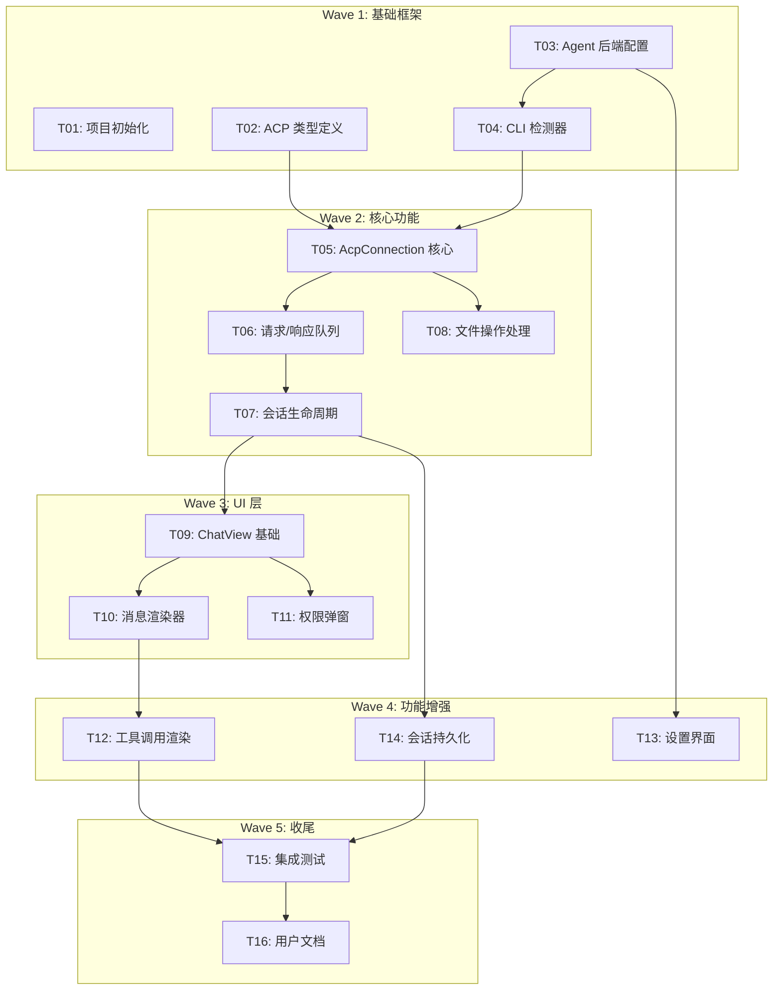

# Obsidian ACP 插件开发执行计划

> 📅 创建时间: 2024-12-18
> 🎯 目标: 为 Obsidian 实现 Agent Client Protocol (ACP) 集成，支持 Claude Code、Codex、Gemini 等 AI Agent

---

## 🔄 规划进度

| 状态 | 波次 | 任务数 | 说明 |
|:---:|:----:|:-----:|------|
| ⏳ | Wave 1 | 4 | 基础框架搭建 |
| ⏳ | Wave 2 | 4 | 核心功能实现 |
| ⏳ | Wave 3 | 3 | UI 层开发 |
| ⏳ | Wave 4 | 3 | 功能增强 |
| ⏳ | Wave 5 | 2 | 测试与文档 |

**已规划**: T01 ~ T16
**待规划**: 无

---

## 📊 预估总览

### Token 容量计算

```
公式: 预估 = (代码行数 × 12) + (对话轮数 × 2k) + (测试输出 × 5k) + 25% 缓冲

Wave 1: ~45k tokens (4 任务，可并行)
Wave 2: ~80k tokens (4 任务，部分依赖)
Wave 3: ~60k tokens (3 任务，依赖 Wave 2)
Wave 4: ~50k tokens (3 任务，依赖 Wave 3)
Wave 5: ~35k tokens (2 任务，依赖全部)

总计预估: ~270k tokens (分 5 批执行)
```

### 任务清单

| Wave | Task-ID | 任务名称 | 预估 Token | 依赖 | 可并行 | 状态 |
|:----:|:-------:|---------|----------:|:----:|:------:|:-----|
| 1 | T01 | 项目初始化与依赖配置 | 8k | - | ✅ | ✅ 完成 (Claude-Terminal-E947, 2025-12-18) |
| 1 | T02 | ACP 类型定义 | 12k | - | ✅ | ✅ 完成 (Claude-Terminal-3505, 2025-12-18) |
| 1 | T03 | Agent 后端配置 | 10k | - | ✅ | ✅ 完成 (Claude-Terminal-E343, 2025-12-18) |
| 1 | T04 | CLI 检测器 | 15k | T03 | ⚠️ | ✅ 完成 (Claude-Terminal-914A, 2025-12-18) |
| 2 | T05 | AcpConnection 核心类 | 25k | T02 | ✅ | ✅ 完成 (Claude-Terminal-5F45, 2025-12-18) |
| 2 | T06 | 请求/响应队列管理 | 18k | T05 | ✅ | ✅ 完成 (Claude-Terminal-5F45, 2025-12-18) |
| 2 | T07 | 会话生命周期管理 | 15k | T06 | ✅ | ✅ 完成 (Claude-Terminal-5F45, 2025-12-18) |
| 2 | T08 | 文件操作处理器 | 12k | T05 | ⚠️ |
| 3 | T09 | ChatView 基础结构 | 20k | T07 | ❌ |
| 3 | T10 | 消息渲染器 | 18k | T09 | ❌ |
| 3 | T11 | 权限请求弹窗 | 12k | T09 | ⚠️ |
| 4 | T12 | 工具调用渲染 | 18k | T10 | ❌ |
| 4 | T13 | 设置界面 | 15k | T03 | ⚠️ |
| 4 | T14 | 会话持久化 | 17k | T07 | ❌ |
| 5 | T15 | 集成测试 | 20k | ALL | ❌ |
| 5 | T16 | 用户文档 | 15k | ALL | ⚠️ |

**图例**: ✅ 完全并行 | ⚠️ 部分并行 | ❌ 串行依赖

---

## 🔗 依赖关系图



---

## 📋 任务详情

### Wave 1: 基础框架搭建

---

#### T01: 项目初始化与依赖配置

**预估**: 8k tokens (~200 行代码, 3 轮对话)

**目标**: 重构现有模板为 ACP 插件项目结构

**必读文档**:
- `manifest.json` - 当前配置
- `package.json` - 当前依赖
- `tmp/AionUi/package.json` - 参考依赖

**Checklist**:
- [ ] 更新 `manifest.json`
  ```json
  {
    "id": "obsidian-acp",
    "name": "ACP Agent Client",
    "isDesktopOnly": true
  }
  ```
- [ ] 更新 `package.json`
  - 添加 `@types/node` 更高版本
  - 确保 TypeScript 版本 >= 5.0
- [ ] 创建目录结构
  ```
  src/
  ├── acp/
  ├── ui/
  └── settings/
  ```
- [ ] 重构 `main.ts` 基础结构
  - 重命名类为 `AcpPlugin`
  - 清理示例代码
  - 添加 View 注册框架

**输出文件**:
- `manifest.json` (修改)
- `package.json` (修改)
- `src/main.ts` (新建/重构)

---

#### T02: ACP 类型定义

**预估**: 12k tokens (~350 行代码, 4 轮对话)

**目标**: 定义完整的 ACP 协议类型

**必读文档**:
- `tmp/agent-client-protocol/schema/schema.json` - 官方 Schema
- `tmp/AionUi/src/types/acpTypes.ts` - 参考实现

**Checklist**:
- [ ] 创建 `src/acp/types/index.ts`
- [ ] 定义 JSON-RPC 基础类型
  ```typescript
  interface AcpRequest { jsonrpc: '2.0'; id: number; method: string; params?: any }
  interface AcpResponse { jsonrpc: '2.0'; id: number; result?: any; error?: AcpError }
  interface AcpNotification { jsonrpc: '2.0'; method: string; params?: any }
  ```
- [ ] 定义初始化相关类型
  - `InitializeParams` / `InitializeResponse`
  - `ClientCapabilities` / `AgentCapabilities`
- [ ] 定义会话相关类型
  - `SessionNewParams` / `SessionNewResponse`
  - `SessionPromptParams` / `SessionPromptResponse`
  - `SessionUpdate` (所有变体)
- [ ] 定义工具调用类型
  - `ToolCallUpdate` / `ToolCallUpdateStatus`
  - `PermissionRequest` / `PermissionResponse`
- [ ] 定义文件操作类型
  - `FileReadRequest` / `FileWriteRequest`
- [ ] 导出所有类型

**输出文件**:
- `src/acp/types/index.ts`
- `src/acp/types/session.ts`
- `src/acp/types/tools.ts`

---

#### T03: Agent 后端配置

**预估**: 10k tokens (~280 行代码, 3 轮对话)

**目标**: 配置支持的 Agent 后端信息

**必读文档**:
- `tmp/AionUi/src/types/acpTypes.ts` - `ACP_BACKENDS_ALL`
- `tmp/agent-client-protocol/docs/overview/agents.mdx`

**Checklist**:
- [ ] 创建 `src/acp/backends/types.ts`
  ```typescript
  interface AgentBackendConfig {
    id: string;
    name: string;
    cliCommand?: string;
    acpArgs?: string[];
    authRequired?: boolean;
    enabled?: boolean;
  }
  ```
- [ ] 创建 `src/acp/backends/claude.ts`
  - 使用 `npx @zed-industries/claude-code-acp`
- [ ] 创建 `src/acp/backends/codex.ts`
  - CLI: `codex --experimental-acp`
- [ ] 创建 `src/acp/backends/gemini.ts`
  - CLI: `gemini` (原生支持)
- [ ] 创建 `src/acp/backends/qwen.ts`
  - CLI: `npx @qwen-code/qwen-code --experimental-acp`
- [ ] 创建 `src/acp/backends/goose.ts`
  - CLI: `goose acp`
- [ ] 创建 `src/acp/backends/index.ts`
  - 导出所有后端配置
  - 提供 `getBackendConfig(id)` 函数

**输出文件**:
- `src/acp/backends/types.ts`
- `src/acp/backends/claude.ts`
- `src/acp/backends/codex.ts`
- `src/acp/backends/gemini.ts`
- `src/acp/backends/qwen.ts`
- `src/acp/backends/goose.ts`
- `src/acp/backends/index.ts`

---

#### T04: CLI 检测器

**预估**: 15k tokens (~400 行代码, 5 轮对话)

**目标**: 自动检测系统已安装的 ACP Agent CLI

**必读文档**:
- `tmp/AionUi/src/agent/acp/AcpDetector.ts`

**依赖**: T03 (需要后端配置)

**Checklist**:
- [ ] 创建 `src/acp/AcpDetector.ts`
- [ ] 实现 `which` / `where` 命令封装
  ```typescript
  async function checkCliExists(cmd: string): Promise<boolean>
  ```
- [ ] 实现并行检测逻辑
  ```typescript
  async function detectInstalledAgents(): Promise<DetectedAgent[]>
  ```
- [ ] 实现单例模式
  ```typescript
  class AcpDetector {
    private static instance: AcpDetector;
    static getInstance(): AcpDetector;
  }
  ```
- [ ] 添加缓存机制（避免重复检测）
- [ ] 处理 Windows / macOS / Linux 差异
- [ ] 导出检测结果类型

**输出文件**:
- `src/acp/AcpDetector.ts`

---

### Wave 2: 核心功能实现

---

#### T05: AcpConnection 核心类

**预估**: 25k tokens (~700 行代码, 8 轮对话)

**目标**: 实现 ACP 协议核心通信层

**必读文档**:
- `tmp/AionUi/src/agent/acp/AcpConnection.ts`
- `tmp/agent-client-protocol/docs/protocol/transports.mdx`
- `tmp/agent-client-protocol/docs/protocol/initialization.mdx`

**依赖**: T02, T04

**Checklist**:
- [ ] 创建 `src/acp/AcpConnection.ts`
- [ ] 实现子进程管理
  ```typescript
  class AcpConnection {
    private child: ChildProcess | null;
    async connect(backend: AgentBackend, cwd: string): Promise<void>;
    disconnect(): void;
  }
  ```
- [ ] 实现 spawn 配置生成
  ```typescript
  private createSpawnConfig(backend: AgentBackendConfig, cwd: string): SpawnConfig
  ```
- [ ] 实现 stdio 数据处理
  - 行分隔的 JSON 解析
  - 缓冲区管理
- [ ] 实现消息分发
  ```typescript
  private handleMessage(message: AcpMessage): void
  ```
- [ ] 实现初始化流程
  ```typescript
  private async initialize(): Promise<InitializeResponse>
  ```
- [ ] 实现 Claude 特殊处理（需要 npx adapter）
- [ ] 添加连接状态属性
  ```typescript
  get isConnected(): boolean;
  get currentBackend(): AgentBackend | null;
  ```

**输出文件**:
- `src/acp/AcpConnection.ts`

---

#### T06: 请求/响应队列管理

**预估**: 18k tokens (~500 行代码, 6 轮对话)

**目标**: 实现可靠的请求队列和超时管理

**必读文档**:
- `tmp/AionUi/src/agent/acp/AcpConnection.ts` (PendingRequest 部分)

**依赖**: T05

**Checklist**:
- [ ] 扩展 `AcpConnection`，添加请求队列
  ```typescript
  private pendingRequests: Map<number, PendingRequest>;
  private nextRequestId: number;
  ```
- [ ] 实现 `sendRequest<T>()` 方法
  - Promise 封装
  - 自动分配 ID
  - 超时处理
- [ ] 实现超时管理
  ```typescript
  interface PendingRequest {
    resolve: Function;
    reject: Function;
    timeoutId: NodeJS.Timeout;
    method: string;
    isPaused: boolean;
    startTime: number;
  }
  ```
- [ ] 实现超时暂停/恢复（权限请求期间）
  ```typescript
  private pauseRequestTimeout(id: number): void;
  private resumeRequestTimeout(id: number): void;
  ```
- [ ] 实现响应路由
  ```typescript
  private routeResponse(response: AcpResponse): void
  ```
- [ ] 添加错误处理和重试逻辑

**输出文件**:
- `src/acp/AcpConnection.ts` (扩展)

---

#### T07: 会话生命周期管理

**预估**: 15k tokens (~400 行代码, 5 轮对话)

**目标**: 实现完整的会话管理功能

**必读文档**:
- `tmp/agent-client-protocol/docs/protocol/session-setup.mdx`
- `tmp/agent-client-protocol/docs/protocol/prompt-turn.mdx`

**依赖**: T06

**Checklist**:
- [ ] 扩展 `AcpConnection`，添加会话管理
  ```typescript
  private sessionId: string | null;
  async newSession(cwd: string): Promise<string>;
  async sendPrompt(content: string | ContentBlock[]): Promise<PromptResponse>;
  cancelSession(): void;
  ```
- [ ] 实现会话更新回调
  ```typescript
  onSessionUpdate: (update: SessionUpdate) => void;
  onEndTurn: () => void;
  ```
- [ ] 实现取消通知
  ```typescript
  async cancelSession(): Promise<void>
  ```
- [ ] 处理 StopReason
  - `end_turn` / `cancelled` / `max_tokens` / `refusal`
- [ ] 添加会话状态查询
  ```typescript
  get hasActiveSession(): boolean;
  get currentSessionId(): string | null;
  ```

**输出文件**:
- `src/acp/AcpConnection.ts` (扩展)

---

#### T08: 文件操作处理器

**预估**: 12k tokens (~320 行代码, 4 轮对话)

**目标**: 处理 Agent 发起的文件读写请求

**必读文档**:
- `tmp/agent-client-protocol/docs/protocol/file-system.mdx`
- `tmp/AionUi/src/agent/acp/AcpConnection.ts` (handleReadTextFile/handleWriteTextFile)

**依赖**: T05

**Checklist**:
- [ ] 创建 `src/acp/FileOperationHandler.ts`
- [ ] 实现文件读取
  ```typescript
  async handleReadTextFile(params: { path: string }): Promise<{ content: string }>
  ```
- [ ] 实现文件写入
  ```typescript
  async handleWriteTextFile(params: { path: string; content: string }): Promise<null>
  ```
- [ ] 实现路径解析（相对路径 → 绝对路径）
  ```typescript
  private resolveWorkspacePath(targetPath: string, cwd: string): string
  ```
- [ ] 集成到 `AcpConnection`
  ```typescript
  onFileOperation: (op: FileOperation) => void;
  ```
- [ ] 添加 Obsidian Vault 集成
  - 使用 `app.vault` API 读写文件
  - 处理 Vault 外文件访问

**输出文件**:
- `src/acp/FileOperationHandler.ts`
- `src/acp/AcpConnection.ts` (集成)

---

### Wave 3: UI 层开发

---

#### T09: ChatView 基础结构

**预估**: 20k tokens (~550 行代码, 7 轮对话)

**目标**: 创建 Obsidian 聊天视图基础框架

**必读文档**:
- Obsidian API: `ItemView` 文档
- `tmp/AionUi/src/renderer/pages/conversation/` (参考布局)

**依赖**: T07

**Checklist**:
- [ ] 创建 `src/ui/ChatView.ts`
- [ ] 实现 `ItemView` 基类
  ```typescript
  class AcpChatView extends ItemView {
    getViewType(): string { return 'acp-chat'; }
    getDisplayText(): string { return 'ACP Chat'; }
    getIcon(): string { return 'message-circle'; }
  }
  ```
- [ ] 实现基础布局
  ```typescript
  async onOpen(): Promise<void> {
    // 创建头部（Agent 选择器）
    // 创建消息容器
    // 创建输入区域
  }
  ```
- [ ] 实现 Agent 选择器
  - 下拉框显示已检测的 Agent
  - 连接/断开按钮
- [ ] 实现输入区域
  - 文本输入框
  - 发送按钮
  - 取消按钮（发送中显示）
- [ ] 实现消息容器
  - 滚动区域
  - 自动滚动到底部
- [ ] 在 `main.ts` 注册视图
  ```typescript
  this.registerView('acp-chat', (leaf) => new AcpChatView(leaf, this));
  ```

**输出文件**:
- `src/ui/ChatView.ts`
- `src/main.ts` (修改)
- `styles.css` (修改)

---

#### T10: 消息渲染器

**预估**: 18k tokens (~480 行代码, 6 轮对话)

**目标**: 渲染聊天消息（用户消息、Agent 回复、系统提示）

**必读文档**:
- `tmp/AionUi/src/agent/acp/AcpAdapter.ts`
- Obsidian API: `MarkdownRenderer`

**依赖**: T09

**Checklist**:
- [ ] 创建 `src/ui/MessageRenderer.ts`
- [ ] 定义消息数据结构
  ```typescript
  interface ChatMessage {
    id: string;
    role: 'user' | 'assistant' | 'system';
    content: string;
    timestamp: number;
    isStreaming?: boolean;
  }
  ```
- [ ] 实现用户消息渲染
  ```typescript
  renderUserMessage(container: HTMLElement, message: ChatMessage): void
  ```
- [ ] 实现 Agent 消息渲染
  - 支持 Markdown
  - 使用 Obsidian `MarkdownRenderer.renderMarkdown()`
- [ ] 实现流式更新
  ```typescript
  appendMessageChunk(messageId: string, chunk: string): void
  ```
- [ ] 实现系统消息渲染（连接状态、错误等）
- [ ] 添加消息样式
  - 用户消息靠右
  - Agent 消息靠左
  - 系统消息居中

**输出文件**:
- `src/ui/MessageRenderer.ts`
- `styles.css` (扩展)

---

#### T11: 权限请求弹窗

**预估**: 12k tokens (~320 行代码, 4 轮对话)

**目标**: 处理 Agent 权限请求交互

**必读文档**:
- `tmp/agent-client-protocol/docs/protocol/tool-calls.mdx`
- `tmp/AionUi/src/types/acpTypes.ts` (AcpPermissionRequest)

**依赖**: T09

**Checklist**:
- [ ] 创建 `src/ui/PermissionModal.ts`
- [ ] 实现 `Modal` 基类
  ```typescript
  class PermissionModal extends Modal {
    constructor(app: App, request: PermissionRequest);
    async waitForResponse(): Promise<PermissionResponse>;
  }
  ```
- [ ] 实现权限请求显示
  - 工具名称和描述
  - 输入参数展示（如命令、文件路径）
- [ ] 实现选项按钮
  - 允许一次 / 始终允许
  - 拒绝一次 / 始终拒绝
- [ ] 实现 Promise 封装
  ```typescript
  private resolve: (response: PermissionResponse) => void;
  ```
- [ ] 添加键盘快捷键
  - Enter: 允许一次
  - Escape: 拒绝一次

**输出文件**:
- `src/ui/PermissionModal.ts`
- `styles.css` (扩展)

---

### Wave 4: 功能增强

---

#### T12: 工具调用渲染

**预估**: 18k tokens (~480 行代码, 6 轮对话)

**目标**: 渲染工具调用状态和结果

**必读文档**:
- `tmp/AionUi/src/agent/acp/AcpAdapter.ts` (createOrUpdateAcpToolCall)
- `tmp/agent-client-protocol/docs/protocol/tool-calls.mdx`

**依赖**: T10

**Checklist**:
- [ ] 创建 `src/ui/ToolCallRenderer.ts`
- [ ] 实现工具调用卡片
  ```typescript
  renderToolCall(container: HTMLElement, toolCall: ToolCallUpdate): HTMLElement
  ```
- [ ] 实现状态指示
  - pending: 灰色，等待图标
  - in_progress: 蓝色，加载动画
  - completed: 绿色，勾选图标
  - failed: 红色，错误图标
- [ ] 实现 Diff 渲染
  - 检测 `content.type === 'diff'`
  - 使用简单 diff 显示（绿色新增、红色删除）
- [ ] 实现终端输出渲染
  - 等宽字体
  - 深色背景
- [ ] 实现折叠/展开功能
- [ ] 实现实时更新
  ```typescript
  updateToolCallStatus(toolCallId: string, update: ToolCallUpdateStatus): void
  ```

**输出文件**:
- `src/ui/ToolCallRenderer.ts`
- `styles.css` (扩展)

---

#### T13: 设置界面

**预估**: 15k tokens (~400 行代码, 5 轮对话)

**目标**: 创建插件设置界面

**必读文档**:
- Obsidian API: `PluginSettingTab`
- `tmp/AionUi/src/types/acpTypes.ts` (AcpBackendConfig)

**依赖**: T03

**Checklist**:
- [ ] 创建 `src/settings/types.ts`
  ```typescript
  interface AcpPluginSettings {
    defaultAgent: string;
    agentPaths: Record<string, string>;
    defaultCwd: 'vault' | 'current_folder' | 'custom';
    customCwd?: string;
    showToolCallDetails: boolean;
    autoApproveRead: boolean;
  }
  ```
- [ ] 创建 `src/settings/SettingsTab.ts`
- [ ] 实现基础设置
  - 默认 Agent 选择（下拉框）
  - 工作目录设置（单选 + 路径输入）
- [ ] 实现 Agent 路径覆盖
  - 每个 Agent 一行
  - 可选覆盖自动检测的路径
- [ ] 实现 UI 偏好设置
  - 显示工具调用详情（开关）
  - 自动批准文件读取（开关）
- [ ] 添加重置按钮
- [ ] 在 `main.ts` 注册设置页

**输出文件**:
- `src/settings/types.ts`
- `src/settings/SettingsTab.ts`
- `src/main.ts` (修改)

---

#### T14: 会话持久化

**预估**: 17k tokens (~450 行代码, 5 轮对话)

**目标**: 本地保存聊天历史

**必读文档**:
- Obsidian API: `Plugin.loadData()` / `Plugin.saveData()`

**依赖**: T07

**Checklist**:
- [ ] 创建 `src/storage/SessionStorage.ts`
- [ ] 定义存储格式
  ```typescript
  interface StoredSession {
    id: string;
    agentId: string;
    cwd: string;
    messages: ChatMessage[];
    createdAt: number;
    updatedAt: number;
  }
  ```
- [ ] 实现保存逻辑
  ```typescript
  async saveSession(session: StoredSession): Promise<void>
  ```
- [ ] 实现加载逻辑
  ```typescript
  async loadSession(id: string): Promise<StoredSession | null>
  async listSessions(): Promise<SessionSummary[]>
  ```
- [ ] 实现删除逻辑
  ```typescript
  async deleteSession(id: string): Promise<void>
  ```
- [ ] 添加自动保存（消息更新时）
- [ ] 实现会话列表 UI（侧边栏或下拉框）
- [ ] 处理大文件分片（避免单个 JSON 过大）

**输出文件**:
- `src/storage/SessionStorage.ts`
- `src/storage/types.ts`
- `src/ui/ChatView.ts` (集成)

---

### Wave 5: 测试与文档

---

#### T15: 集成测试

**预估**: 20k tokens (~500 行代码, 7 轮对话)

**目标**: 确保核心功能正常工作

**依赖**: ALL

**Checklist**:
- [ ] 手动测试清单
  - [ ] Claude Code 连接测试
  - [ ] Codex 连接测试
  - [ ] Gemini CLI 连接测试
  - [ ] 消息发送/接收
  - [ ] 流式输出
  - [ ] 工具调用权限请求
  - [ ] 文件读写操作
  - [ ] 会话取消
  - [ ] 设置保存/加载
  - [ ] 会话持久化
- [ ] 修复发现的 Bug
- [ ] 性能优化
  - 大消息渲染优化
  - 内存泄漏检查
- [ ] 错误处理完善
  - 网络超时
  - Agent 崩溃
  - 无效响应

**输出文件**:
- 各模块 Bug 修复
- `TESTING.md` (测试报告)

---

#### T16: 用户文档

**预估**: 15k tokens (~文档内容)

**目标**: 编写用户使用文档

**依赖**: T15

**Checklist**:
- [ ] 更新 `README.md`
  - 项目简介
  - 功能特性
  - 安装方法
  - 支持的 Agent 列表
- [ ] 编写快速开始指南
  - 安装 Claude Code / Codex / Gemini CLI
  - 配置插件
  - 发送第一条消息
- [ ] 编写设置说明
  - 各选项含义
  - 推荐配置
- [ ] 编写常见问题 FAQ
  - Agent 连接失败
  - 权限问题
  - 性能问题
- [ ] 添加截图

**输出文件**:
- `README.md` (重写)
- `docs/QUICK_START.md`
- `docs/FAQ.md`

---

## 🚀 执行指南

### 并行执行建议

```
Wave 1 (可完全并行):
  Agent 1: T01 项目初始化
  Agent 2: T02 类型定义
  Agent 3: T03 后端配置
  等待 T03 完成后 → Agent 3 继续: T04 CLI 检测器

Wave 2 (串行为主):
  等待 T02, T04 完成后 → T05 → T06 → T07
  T05 完成后可并行启动 T08

Wave 3 (部分并行):
  等待 T07 完成后 → T09
  T09 完成后: T10, T11 可并行

Wave 4 (部分并行):
  T10 完成后 → T12
  T03 完成后 → T13 (可提前到 Wave 2 执行)
  T07 完成后 → T14

Wave 5 (串行):
  ALL → T15 → T16
```

### 检查点

| 检查点 | 触发条件 | 验收标准 |
|--------|---------|---------|
| CP1 | Wave 1 完成 | 项目可编译，类型无错误 |
| CP2 | Wave 2 完成 | 能连接 Claude Code 并初始化 |
| CP3 | Wave 3 完成 | 能发送消息并显示回复 |
| CP4 | Wave 4 完成 | 完整功能可用 |
| CP5 | Wave 5 完成 | 可发布版本 |

---

## 📝 变更日志

| 日期 | 版本 | 变更内容 |
|------|------|---------|
| 2024-12-18 | v1.0 | 初始规划，16 个任务，5 个波次 |

